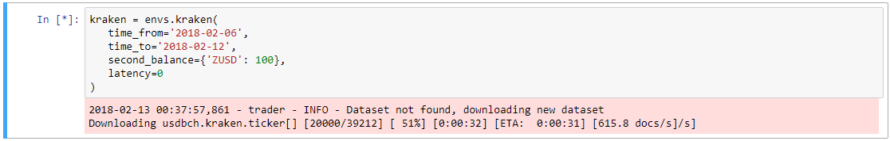

# Environment
This package is designed to interact with the data server, test strategies an historical data, easily deploy strategies to production. It includes exchange emulator, backtest and template trader class.

Pull Requests welcome and encouraged.

Examples are available in examples folder.

# Installation

```python
python setup.py install
```

# Running example

The backtest class requires exchange connector which can be a real exchange through [ccxt](https://github.com/ccxt/ccxt) or a ccxt-identical exchange emulator.

To get dataset you need to specify date range in exchange emulator constructor. If there is first time with that date range dataset will be downloaded.


